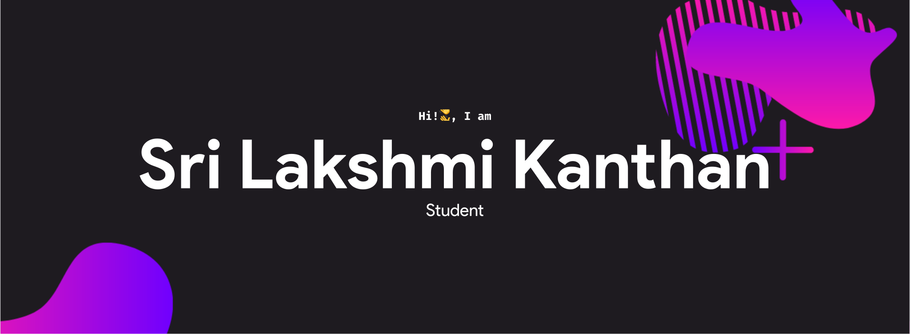

<!--
 Copyright (c) 2021 Sri Lakshmi Kanthan P
 
 This software is released under the MIT License.
 https://opensource.org/licenses/MIT
-->

<h2 align="center"> 
  
</h2>

 

Hello, I am Sri Lakshmi Kanthan a student from TamilNadu, Currently studing Information Technology at Anna University, Trichy. I am a self-taught Developer and I love to learn new things. Other than programming I love math and physics.

<h4 align="center">
  <a href="mailto:srilakshmikanthanp@gmail.com"> Email </a> | <a href="https://srilakshmikanthanp.github.io" target="_blank">Website</a>
</h4>

